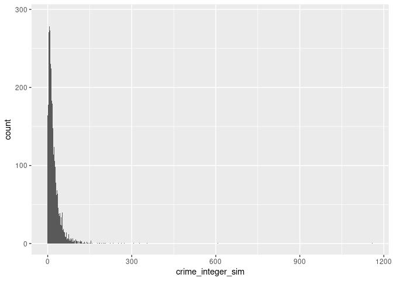

Statistical Methods for Criminology: Practical One
================
Ben Matthews
2024-09-04

# getting started ———————————————————

the following lines will install packages on your computer if you don’t
have them already

``` r
if(!require(tidyverse)){
  install.packages("tidyverse")
  library(tidyverse)
}
```

    ## Loading required package: tidyverse

    ## ── Attaching core tidyverse packages ──────────────────────── tidyverse 2.0.0 ──
    ## ✔ dplyr     1.1.4     ✔ readr     2.1.5
    ## ✔ forcats   1.0.0     ✔ stringr   1.5.1
    ## ✔ ggplot2   3.4.4     ✔ tibble    3.2.1
    ## ✔ lubridate 1.9.3     ✔ tidyr     1.3.1
    ## ✔ purrr     1.0.2     
    ## ── Conflicts ────────────────────────────────────────── tidyverse_conflicts() ──
    ## ✖ dplyr::filter() masks stats::filter()
    ## ✖ dplyr::lag()    masks stats::lag()
    ## ℹ Use the conflicted package (<http://conflicted.r-lib.org/>) to force all conflicts to become errors

``` r
if(!require(broom)){
  install.packages("broom")
  library(broom)
}
```

    ## Loading required package: broom

# data ——————————————————————–

see pages 58-63 at
<https://www.gov.scot/binaries/content/documents/govscot/publications/statistics/2020/09/simd-2020-technical-notes/documents/simd-2020-technical-notes/simd-2020-technical-notes/govscot%3Adocument/SIMD%2B2020%2Btechnical%2Bnotes.pdf>

because counts smaller than three were suppressed due to disclosure
control, i have simulated crime counts for datazones with fewer than
three crimes, allocating them 0, 1 or 2 crimes with equal probability

i also created a simulated violent crime variable by multiplying the
total crime count for the datazone by 0.24 (as non-sexual crimes of
violence make up 24% of recorded crime see \# from
<https://www.gov.scot/publications/recorded-crime-scotland-2023-24/pages/4/>)
these variables are just intended to illustrate the methods discussed in
this course - they won’t tell us anything informative about crime in
Scotland (unless by accident)

all other data comes from the Scottish Index of Multiple Deprivation
ranks and indicators

# read in the data ——————————————————–

``` r
simd <- readRDS(url("https://github.com/benmatthewsed/statistical-methods-criminology-slides/raw/master/resources/simd_crime_sim.rds"))
```

# descriptives ————————————————————

our key outcome is crime_integer_sim

``` r
simd |> 
  ggplot(aes(x = crime_integer_sim)) +
  geom_histogram(binwidth = 1)
```

<!-- -->

very skewed! the average crime count is just over 22 but there is a lot
of variability around this (sd of 32), and no datazones with less than
zero crimes … which makes sense!

``` r
simd |> 
  summarise(mean_crime = mean(crime_integer_sim),
            sd_crime = sd(crime_integer_sim),
            min_crime = min(crime_integer_sim),
            max_crime = max(crime_integer_sim))
```

    ## # A tibble: 1 × 4
    ##   mean_crime sd_crime min_crime max_crime
    ##        <dbl>    <dbl>     <dbl>     <dbl>
    ## 1       22.3     32.7         0      1159

lets do the same for violent crime

``` r
simd |> 
  summarise(mean_vio = mean(vio_integer_sim),
            sd_vio = sd(vio_integer_sim),
            min_vio = min(vio_integer_sim),
            max_vio = max(vio_integer_sim))
```

    ## # A tibble: 1 × 4
    ##   mean_vio sd_vio min_vio max_vio
    ##      <dbl>  <dbl>   <int>   <int>
    ## 1     4.86   7.86       0     278

we will use overall SIMD (simd2020v2_rank) as our main independent
variable this ranks all 6976 datazones from most (1) to least (6976)
deprived so it is uniformly distributed with a mean halfway from 1 to
6976

``` r
simd |> 
  summarise(mean_simd = mean(simd2020_rank),
            sd_simd = sd(simd2020_rank),
            min_simd = min(simd2020_rank),
            max_simd = max(simd2020_rank))
```

    ## # A tibble: 1 × 4
    ##   mean_simd sd_simd min_simd max_simd
    ##       <dbl>   <dbl>    <dbl>    <dbl>
    ## 1     3488.   2014.        1     6976

# regression modelling —————————————————-

we will compare linear and count models for overall crime and violence

# linear model

``` r
lm(crime_integer_sim ~ 1, data = simd) |> 
  broom::tidy()
```

    ## # A tibble: 1 × 5
    ##   term        estimate std.error statistic p.value
    ##   <chr>          <dbl>     <dbl>     <dbl>   <dbl>
    ## 1 (Intercept)     22.3     0.392      56.9       0

the intercept is the same as the mean crime count we calculated
manually - that’s good!

``` r
glm(crime_integer_sim ~ 1, 
    family = "poisson",
    data = simd) |> 
  broom::tidy()
```

    ## # A tibble: 1 × 5
    ##   term        estimate std.error statistic p.value
    ##   <chr>          <dbl>     <dbl>     <dbl>   <dbl>
    ## 1 (Intercept)     3.10   0.00254     1224.       0

the estimate is 3.10. we need to exp() this to get the estimate on the
outcome scale this is because the poisson model uses the log link
function to link the coefficients to the observed data

``` r
glm(crime_integer_sim ~ 1, 
    family = "poisson",
    data = simd) |> 
  broom::tidy() |> 
  mutate(exp_est = exp(estimate))
```

    ## # A tibble: 1 × 6
    ##   term        estimate std.error statistic p.value exp_est
    ##   <chr>          <dbl>     <dbl>     <dbl>   <dbl>   <dbl>
    ## 1 (Intercept)     3.10   0.00254     1224.       0    22.3

exp_est is 22.3 - same as that we calculated already

# now let’s try a quasipoisson

``` r
glm(crime_integer_sim ~ 1, 
    family = "quasipoisson",
    data = simd) |> 
  broom::tidy() |> 
  mutate(exp_est = exp(estimate))
```

    ## # A tibble: 1 × 6
    ##   term        estimate std.error statistic p.value exp_est
    ##   <chr>          <dbl>     <dbl>     <dbl>   <dbl>   <dbl>
    ## 1 (Intercept)     3.10    0.0176      177.       0    22.3

the results are the same! but note the std.error column - this is now
much larger (0.0176) than in the previous model (0.00254) this reflects
the quasi poisson correcting for over-dispersion

# crime and SIMD ———————————————————-

let’s look at the relationship between crime and SIMD

``` r
mod_crime_simd_lm <- lm(crime_integer_sim ~ simd2020_rank, data = simd)

mod_crime_simd_lm |> 
  broom::tidy()
```

    ## # A tibble: 2 × 5
    ##   term          estimate std.error statistic   p.value
    ##   <chr>            <dbl>     <dbl>     <dbl>     <dbl>
    ## 1 (Intercept)   42.2      0.733         57.5 0        
    ## 2 simd2020_rank -0.00571  0.000182     -31.3 7.20e-202

SIMD is negative and statistically significant - with less deprivation
(i.e. as SIMD increases) we would expect less crime

``` r
mod_crime_simd_p <- glm(crime_integer_sim ~ simd2020_rank, family = "poisson", data = simd)

mod_crime_simd_p |> 
  broom::tidy() |> 
  mutate(exp_est = exp(estimate))
```

    ## # A tibble: 2 × 6
    ##   term           estimate  std.error statistic p.value exp_est
    ##   <chr>             <dbl>      <dbl>     <dbl>   <dbl>   <dbl>
    ## 1 (Intercept)    3.90     0.00421         927.       0   49.6 
    ## 2 simd2020_rank -0.000271 0.00000137     -198.       0    1.00

the poisson model tells us the same, although the exp_est is rounded to
1.00 if we calculate this directly we see it is 0.9997

``` r
exp(-0.000271)
```

    ## [1] 0.999729

for every increase in SIMD you have 99.97% as much crime, or if you
like, a 1 - exp(-0.000271) - 0.027% increase in crime

# modelling violence ——————————————————

``` r
mod_vio_simd_lm <- lm(vio_integer_sim ~ simd2020_rank, 
                      data = simd)

mod_vio_simd_p <- glm(vio_integer_sim ~ simd2020_rank, 
                      family = "poisson",
                      data = simd)

mod_vio_simd_lm |> 
  broom::tidy() |> 
  mutate(conf_low = estimate - 1.96 * std.error, # we can calculate confidence intervals for these coefficients
         conf_upp = estimate + 1.96 * std.error)
```

    ## # A tibble: 2 × 7
    ##   term          estimate std.error statistic   p.value conf_low conf_upp
    ##   <chr>            <dbl>     <dbl>     <dbl>     <dbl>    <dbl>    <dbl>
    ## 1 (Intercept)    9.64    0.176          54.7 0          9.30     9.99   
    ## 2 simd2020_rank -0.00137 0.0000438     -31.4 5.21e-202 -0.00146 -0.00129

as before, simd is negatively and statistically significantly related to
our crime indicator

# let’s see this in the poisson model

``` r
mod_vio_simd_p |> 
  broom::tidy() |> 
  mutate(exp_est = exp(estimate),
         conf_low = estimate - 1.96 * std.error,
         conf_upp = estimate + 1.96 * std.error,
         exp_conf_low = exp(conf_low),
         exp_conf_upp = exp(conf_upp))
```

    ## # A tibble: 2 × 10
    ##   term           estimate  std.error statistic p.value exp_est conf_low conf_upp
    ##   <chr>             <dbl>      <dbl>     <dbl>   <dbl>   <dbl>    <dbl>    <dbl>
    ## 1 (Intercept)    2.46     0.00888         277.       0   11.7   2.44e+0  2.47e+0
    ## 2 simd2020_rank -0.000303 0.00000300     -101.       0    1.00 -3.09e-4 -2.97e-4
    ## # ℹ 2 more variables: exp_conf_low <dbl>, exp_conf_upp <dbl>

we might want to look at a quasipoisson model in case the the standard
errors in the poisson are too small

``` r
mod_vio_simd_qp <- glm(vio_integer_sim ~ simd2020_rank, 
                      family = "quasipoisson",
                      data = simd)

mod_vio_simd_qp |> 
  broom::tidy() |> 
  mutate(exp_est = exp(estimate),
         conf_low = estimate - 1.96 * std.error,
         conf_upp = estimate + 1.96 * std.error,
         exp_conf_low = exp(conf_low),
         exp_conf_upp = exp(conf_upp))
```

    ## # A tibble: 2 × 10
    ##   term          estimate std.error statistic   p.value exp_est conf_low conf_upp
    ##   <chr>            <dbl>     <dbl>     <dbl>     <dbl>   <dbl>    <dbl>    <dbl>
    ## 1 (Intercept)    2.46e+0 0.0313         78.5 0           11.7   2.40e+0  2.52e+0
    ## 2 simd2020_rank -3.03e-4 0.0000106     -28.7 8.04e-171    1.00 -3.24e-4 -2.82e-4
    ## # ℹ 2 more variables: exp_conf_low <dbl>, exp_conf_upp <dbl>

the standard error is much larger - this might indicate that we should
be worried about over-dispersion

# over to you ————————————————————-

using either the models above, or by using the additional variables in
the SIMD data to fit your own model, write a summary of what this
analysis can and can’t tell us about the relationship between
deprivation and crime in Scotland what are the pros and cons of the
different modelling approaches? what are the limitations of the data
used?
