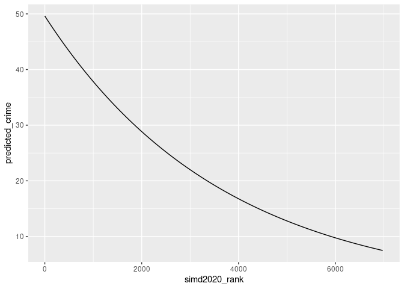
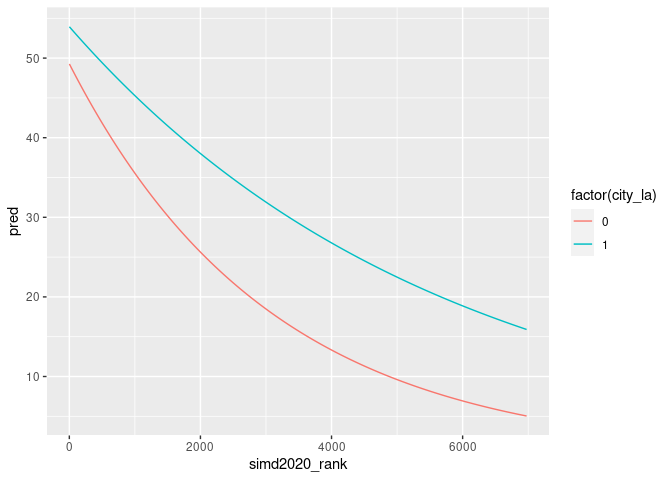
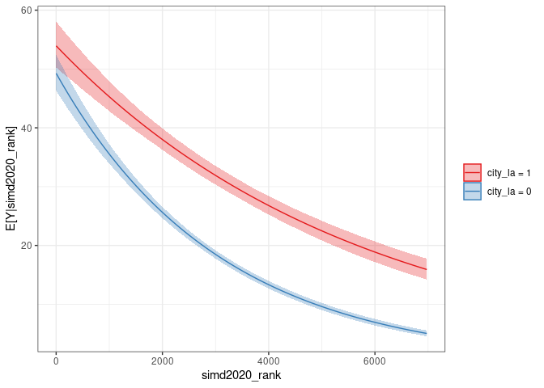

Statistical Methods for Criminology: Practical Four
================
Ben Matthews
2024-09-04

# getting started ———————————————————

the following lines will install packages on your computer if you don’t
have them already

``` r
if(!require(tidyverse)){
  install.packages("tidyverse")
  library(tidyverse)
}
```

    ## Loading required package: tidyverse

    ## ── Attaching core tidyverse packages ──────────────────────── tidyverse 2.0.0 ──
    ## ✔ dplyr     1.1.4     ✔ readr     2.1.5
    ## ✔ forcats   1.0.0     ✔ stringr   1.5.1
    ## ✔ ggplot2   3.4.4     ✔ tibble    3.2.1
    ## ✔ lubridate 1.9.3     ✔ tidyr     1.3.1
    ## ✔ purrr     1.0.2     
    ## ── Conflicts ────────────────────────────────────────── tidyverse_conflicts() ──
    ## ✖ dplyr::filter() masks stats::filter()
    ## ✖ dplyr::lag()    masks stats::lag()
    ## ℹ Use the conflicted package (<http://conflicted.r-lib.org/>) to force all conflicts to become errors

``` r
if(!require(broom)){
  install.packages("broom")
  library(broom)
}
```

    ## Loading required package: broom

``` r
if(!require(clarify)){
  install.packages("clarify")
  library(clarify)
}
```

    ## Loading required package: clarify

# data ——————————————————————–

see pages 58-63 at
<https://www.gov.scot/binaries/content/documents/govscot/publications/statistics/2020/09/sim-2020-technical-notes/documents/simd-2020-technical-notes/simd-2020-technical-notes/govscot%3Adocument/SIMD%2B220%2Btechnical%2Bnotes.pdf>
because counts smaller than three were suppressed due to disclosure
control, i have simulated crime counts for datazones with fewer than
three crimes, allocating them 0, 1 or 2 crimes with equal probability i
also created a simulated violent crime variable by multiplying the total
crime count for the datazone by 0.24 (as non-sexual crimes of violence
make up 24% of recorded crime see \# from
<https://www.gov.scot/publications/recorded-crime-scotland-2023-24/pages/4/>)
these variables are just intended to illustrate the methods discussed in
this course - they won’t tell us anything informative about crime in
Scotland (unless by accident) all other data comes from the Scottish
Index of Multiple Deprivation ranks and indicators

# read in the data ——————————————————–

``` r
simd <- readRDS(url("https://github.com/benmatthewsed/statistical-methods-criminology-slides/raw/master/resources/simd_crime_sim.rds"))
```

# let’s fit the model from the first practical again

``` r
qp_mod <- 
  glm(crime_integer_sim ~ simd2020_rank,
      family = "quasipoisson",
      data = simd)
```

we can use this model to visualize predicted values of expected crime at
different levels of SIMD

``` r
simd_range <- data.frame(simd2020_rank = seq(1, 6976)) # make a prediction for all SIMD ranks

data.frame(
  predicted_crime = 
    predict(qp_mod,
        newdata = simd_range, # make a prediction for all SIMD ranks
        type = "response") # gives us predictions on the response scale
  ) |> 
  mutate(simd2020_rank = seq(1, 6976)) |> 
  ggplot(aes(x = simd2020_rank, y = predicted_crime)) +
  geom_line()
```

<!-- -->

# plotting predictions with two variables ———————————

maybe the overall relationship between deprivation and crime works
differently in cities versus other areas? we’ll compare SIMD and
recorded crime in ‘City’ local authorities to other local authorities
(note that we could have used other operationalizations here, such as
the Scottish Government’s rural/urban lassification) create our city_la
variable based on whether the LA name has ‘City’ in it

``` r
simd <- 
simd |> 
  mutate(city_la = if_else(str_detect(council_area, "City"),
                           1,
                           0))
```

fit our count model, including an interaction between SIMD and city_la
so city LAs get their own SIMD trend, and so do non-city LAs

(without the interaction the trends are forced to be parallel)

``` r
qp_mod <- 
glm(crime_integer_sim ~ simd2020_rank * city_la,
    family = "quasipoisson",
    data = simd)
```

let’s check the coefficients

``` r
qp_mod |> 
  broom::tidy()
```

    ## # A tibble: 4 × 5
    ##   term                   estimate std.error statistic   p.value
    ##   <chr>                     <dbl>     <dbl>     <dbl>     <dbl>
    ## 1 (Intercept)            3.90     0.0323       121.   0        
    ## 2 simd2020_rank         -0.000327 0.0000109    -30.1  3.63e-187
    ## 3 city_la                0.0905   0.0490         1.85 6.48e-  2
    ## 4 simd2020_rank:city_la  0.000152 0.0000156      9.75 2.47e- 22

the main effect of city la is not statistically significant at p \<
0.05, but the interaction is therefore we keep both

we can calculate adjusted predictions to visualize this interaction

we can do this just using predict(), asking it to give us predictions
for all datazone SIMD ranks (1 to 6976), and under the condition of
being in a city_la or not

``` r
pred_df <- tidyr::crossing(simd2020_rank = seq(1:6976),
                           city_la = c(0, 1))

simd_preds <- 
predict(
  qp_mod,
  newdata = pred_df,
  type = "response"
)

pred_df |> 
  mutate(pred = simd_preds) |> 
  ggplot(aes(x = simd2020_rank, y = pred, colour = factor(city_la))) +
  geom_line()
```

<!-- -->

the lines are very similar where simd2020_rank is close to zero (which
explains why the main effect was not statistically significant) but they
diverge as SIMD rank increases deprived non-city neighbourhoods are
quite similar to deprived city neighourhoods but in places with low
deprivation city neighbourhoods and non-city neighbourhoods seem quite
different

this is fine so far, but really we want to assess the uncertainty in
these estimates

# we can do this with {clarify}

first we simulate coefficients from our model

``` r
sims <- clarify::sim(qp_mod,
                     n = 1000) # this is the default number.  try increasing it and see what happens
```

we can use sim_setx to make predictions for the outcome (on the outcome
scale) across a grid of predictors that we provide

``` r
sim_res <- sim_setx(sims, x = list(simd2020_rank = seq(1:6976), city_la = c(1, 0)),
         verbose = TRUE) # verbose = TRUE gives a status bar showing how long the simulation is taking

plot(sim_res)
```

<!-- -->

the solid lines are the same as those we calculated by hand, but we now
get error bands showing the 95% confidence intervals these bands overlap
at high levels of deprivation, showing that - based on our model - it
looks like city and non-city areas that are very deprived have similar
crime rates

# questions —————————————————————

based on the description of the SIMD crime data at see pages 58-63 at
<https://www.gov.scot/binaries/content/documents/govscot/publications/statistics/2020/09/simd-2020-technical-notes/documents/simd-2020-technical-notes/simd-2020-technical-notes/govscot%3Adocument/SIMD%2B2020%2Btechnical%2Bnotes.pdf>
and the discussion in sessions three and four write a brief description
of the figure produced by the code above, and reflect on the value of
the prediction and simulation approach to translating the coefficients

what are the benefits? what are the limitations?

# going further: using clarify with our own function ————————————-

in the last example we used a built in function from clarify now we’ll
recreate the example from the lectures of calculating victimization
inequality

load in the data

``` r
dat <-
  tribble(
    ~prev, ~year, ~sex, ~n,
    0.167, "2015", "men", 15030,
    0.153, "2015", "women", 18320,
    0.197, "2020", "men", 15505,
    0.189, "2020", "women", 18230
  )
```

calculate the number of victims

``` r
dat <-
  dat |> 
  mutate(vict = as.integer(n * prev))
```

define our victim divide function

``` r
victim_divide <- function(base_y1, base_y2){
  ((base_y2 - 1) - (base_y1 - 1)) / (base_y1 - 1)
}
```

fit a model to calculate the odds of being a victim for men and women,
with an interaction with year for clarify we need the results to be part
of the same model - in the example in the slides we fit two seperate
models, to dollow the format of Hunter and Tseloni (2016)

``` r
mod1 <- glm(cbind(vict, n - vict) ~ fct_rev(sex) * year,
            family = "binomial",
            data = dat)

s <- sim(mod1,
         n = 1000)
```

this function is quite complicated, but it’s just extracting the right
coefficients

``` r
sim_victim_divide <- function(coefs) {
  
  men_2015 <- unname(coefs["fct_rev(sex)men"])
  men_interact <- unname(coefs["fct_rev(sex)men:year2020"])
  
  men_2020 <- men_2015 + men_interact
  
  or_2015 <- exp(men_2015)
  or_2020 <- exp(men_2020)
  
  victim_divide(or_2015, or_2020)
  
}
```

test on our model

``` r
sim_victim_divide(coef(mod1))
```

    ## [1] -0.5223449

now apply

``` r
est2 <- sim_apply(s, 
                  FUN = sim_victim_divide)

tibble(x = as.vector(est2)) |> 
  reframe(vds = quantile(x, c(0.01, 0.025, 0.05, 0.1, 0.25, 0.5, 0.75, 0.9, 0.95, 0.975, 0.99)),
          vals = c(0.01, 0.025, 0.05, 0.1, 0.25, 0.5, 0.75, 0.9, 0.95, 0.975, 0.99))
```

    ## # A tibble: 11 × 2
    ##        vds  vals
    ##      <dbl> <dbl>
    ##  1 -1.09   0.01 
    ##  2 -1.00   0.025
    ##  3 -0.916  0.05 
    ##  4 -0.833  0.1  
    ##  5 -0.694  0.25 
    ##  6 -0.519  0.5  
    ##  7 -0.274  0.75 
    ##  8  0.0212 0.9  
    ##  9  0.280  0.95 
    ## 10  0.488  0.975
    ## 11  1.11   0.99

as previously, the 97.5 percenticle is above 0, suggesting that the
change in the VD over time is not statistically significant note that
the median VD from our simulations is not identical to the result we
calculated from the original model coefficients this is called
monte-carlo error - and as a result, the point estimates from the
original model are preferable to the median of the simulations see
Rainey, C. (2023). A careful consideration of CLARIFY:
Simulation-induced bias in point estimates of quantities of interest.
Political Science Research and Methods, 1–10.
<https://doi.org/10.1017/psrm.2023.8>

# going even further ——————————————————

read the clarify documentation at <https://iqss.github.io/clarify/> fit
another model to the SIMD data and desribe the results using some of
clarify’s functionality
